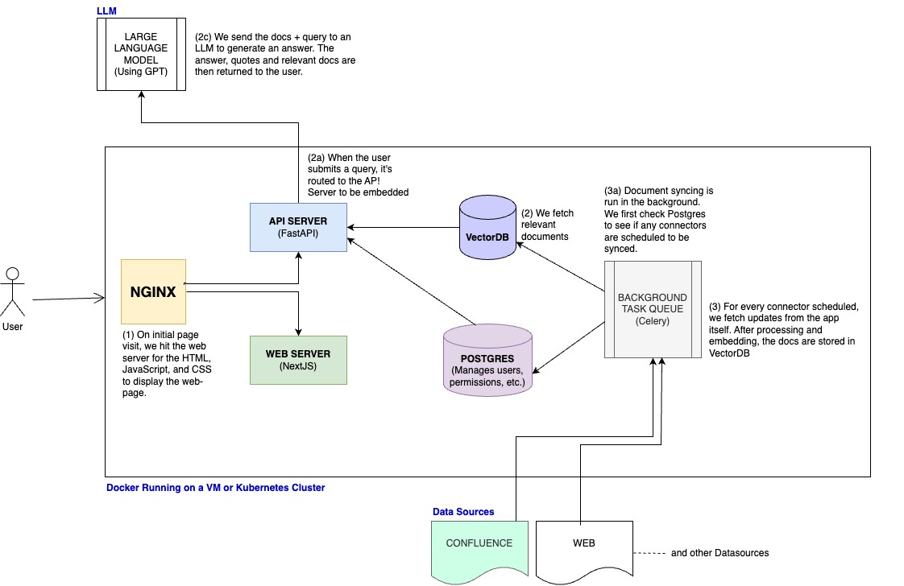

# PayserAi:
<h4>Paysera-Ai: Real-time Q/A using LLM for labeled Confluence pages & Multiple DataSources</h4>
Paysera-ai is an enterprise question-answering system that allows users to ask natural language questions against internal documents and receive reliable answers. These answers are backed by quotes and references from the source material, ensuring trustworthiness.The application aims to bridge the gap between static Confluence content and dynamic user queries. By leveraging advanced language models and vector similarity search, the application provides real-time, contextually relevant answers to user questions based on the updated content stored in Confluence.


 

## Features:

- Dynamic QA: Provides answers to user queries using the content indexed from Confluence.
- Extract, Embedding and indexing according to filter of labeled pages in Confluence pages using CQL.
- Using Update version of labeled confluence pages.(if page is updated or changed the answer will be updated version of contents)
- Real-time Indexing: Automatic syncing and re-indexing ensure that the chatbot's answers are always based on the latest content.
- Integration with Vector Stores: The application leverages vector similarity search for efficient and accurate retrieval of answers.
- Access Management and User management: Includes user authentication via your google account.
- Secure Access: Ensures that only authorized users can access and configure the chatbot.
- Custom Assistans to be able to customize and define your own prompt. for example anser your question in Lithuanian, or explain your question like five years old.
- Advanced UI/UX.
- Admin Panel to config and monitor everything.(shows the last update time and number of document or pages that added)
- LLM Support: Compatible with various LLMs like GPT4.
- Admin Dashboard: For managing connectors and setting up features like live update fetching.(shows the last update time and number of document or pages that added)

<br><br>


<br><br>

# To build the containers from source and start Payserai:
#### start
- ```docker compose -f docker-compose.yml -p payserai-stack up  --build --force-recreate```
#### stop
- ```docker compose -f docker-compose.yml -p payserai-stack down -v```
- ```-v``` at the end to delete the volumes


Bring up your docker engine and run:
- Setup your .env files


# PayserAi - Get Started 🚀

Welcome to PayserAi, a powerful and fully functional app designed to make your life easier. To get the best out of PayserAi, you'll need to set up a few external services:

- **Postgres** (Relational Database)
- **Vespa** (Vector Database/Search Engine)

This guide will walk you through the process of setting up these services outside of Docker, which is often more convenient for development. However, you can also use the Docker containers and update them with local changes using the `--build` flag.

## Local Setup (without Docker or docker-compose)

We recommend using Python version **3.11** or higher.

> **Note:** This guide omits user authentication setup for simplicity.

### Installing Requirements

We use `pip` for package management, and it's a good idea to create a virtual environment to keep your dependencies isolated. Here's how you can do it:

```bash
python -m venv .venv
source .venv/bin/activate
```

Once your virtual environment is activated, install the required Python dependencies:

```bash
pip install -r backend/requirements/default.txt
pip install -r backend/requirements/dev.txt
```

### Dependent Docker Containers

To start Vespa and Postgres, first navigate to `PayserAi/backend`, then run:

```bash
docker compose -f docker-compose.dev.yml -p PayserAi-stack up -d index relational_db
```

> `index` refers to Vespa and `relational_db` refers to Postgres.

## Running PayserAi

1. **Setup Config Folder:**

   Navigate to `PayserAi/backend` and create a folder to store config:

   ```bash
   mkdir dynamic_config_storage
   ```


2. **Package the Vespa Schema:**

   This step is only necessary if the Vespa schema has been updated locally. Navigate to `PayserAi/backend/PayserAi/document_index/vespa/app_config` and run:

   ```bash
   zip -r ../vespa-app.zip .
   ```

   > **Note:** If you don't have the `zip` utility, install it before running the above command.

3. **Run DB Migrations:**

   The first time you run PayserAi, you’ll need to apply the DB migrations for Postgres. This step is only necessary once, unless the DB models change. Navigate to `PayserAi/backend` with the virtual environment active, and run:

   ```bash
   alembic upgrade head
   ```

4. **Start the Task Queue:**

   This queue orchestrates background jobs, running longer tasks asynchronously from the API server. Still in the `PayserAi/backend` directory, run:

   ```bash
   python ./scripts/dev_run_background_jobs.py
   ```

5. **Run the Backend API Server:**

   Finally, to start the backend API server, navigate back to `PayserAi/backend` and run:

   ```bash
   AUTH_TYPE=disabled \
   DYNAMIC_CONFIG_DIR_PATH=./dynamic_config_storage \
   VESPA_DEPLOYMENT_ZIP=./PayserAi/document_index/vespa/vespa-app.zip \
   uvicorn PayserAi.main:app --reload --port 8080
   ```

   > **Note:** For finer logging, add the environment variable `LOG_LEVEL=DEBUG` to the relevant services.


